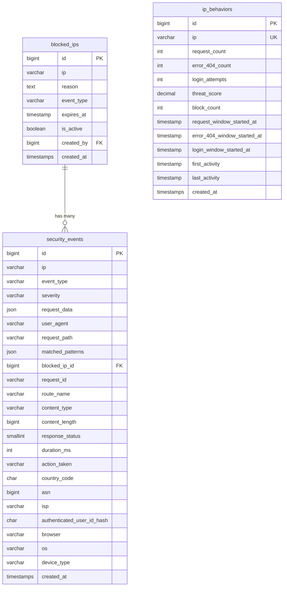
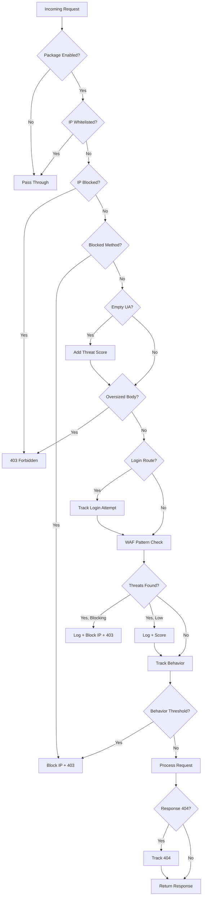

# 📋 Product Requirements Document (PRD)

## Laravel CrowdSec — Lightweight WAF Protection for Laravel

| Field            | Value                              |
| ---------------- | ---------------------------------- |
| **Product Name** | `rilo-arbabillah/laravel-crowdsec` |
| **Version**      | 1.2.x (development)               |
| **Author**       | Rilo Arbabillah                    |
| **License**      | MIT                                |
| **Last Updated** | 2026-07-19                         |

---

## 1. Problem Statement

Aplikasi Laravel rentan terhadap serangan web yang umum seperti **SQL Injection, XSS, Path Traversal, Command Injection**, dan lainnya. Solusi WAF (Web Application Firewall) yang tersedia saat ini umumnya:

- **Berat dan mahal** (Cloudflare Pro, AWS WAF, CrowdSec full deployment)
- **Memerlukan infrastruktur tambahan** (reverse proxy, agent terpisah)
- **Sulit dikonfigurasi** untuk developer Laravel biasa
- **Tidak terintegrasi** langsung dengan ekosistem Laravel

> [!IMPORTANT]
> **Kebutuhan inti**: Sebuah package Laravel yang **ringan, plug-and-play**, dan menyediakan proteksi WAF tingkat aplikasi tanpa memerlukan infrastruktur eksternal.

---

## 2. Goals & Success Metrics

### Goals

1. Menyediakan proteksi WAF **langsung di level aplikasi** Laravel
2. **Zero-config setup** — install, migrate, dan langsung aktif
3. Deteksi **12+ jenis serangan** web secara real-time
4. IP blocking otomatis dengan **progressive escalation**
5. **Tidak mengganggu performa** — fail-open design

### Success Metrics

| Metric                                       | Target    |
| -------------------------------------------- | --------- |
| Installation time (composer install → aktif) | < 5 menit |
| False positive rate pada traffic normal      | < 0.1%    |
| Latency overhead per request                 | < 5ms     |
| Attack detection coverage (OWASP Top 10)     | ≥ 80%     |
| Test coverage (unit test)                    | ≥ 85%     |
| Package downloads (6 bulan pertama)          | ≥ 500     |

---

## 3. Target Users

| Persona               | Deskripsi                                                |
| --------------------- | -------------------------------------------------------- |
| **Laravel Developer** | Developer yang butuh basic WAF tanpa setup infrastruktur |
| **Startup/SMB**       | Tim kecil tanpa dedicated security engineer              |
| **SysAdmin**          | Admin yang butuh monitoring ancaman di level aplikasi    |
| **Enterprise**        | Sebagai layer tambahan di samping WAF infrastruktur      |

---

## 4. User Stories

### Core Protection

- Sebagai **developer**, saya ingin package yang bisa diinstall via Composer dan langsung aktif, sehingga saya tidak perlu konfigurasi rumit.
- Sebagai **developer**, saya ingin request berbahaya otomatis di-block, sehingga aplikasi saya terlindungi tanpa perlu menulis kode custom.
- Sebagai **developer**, saya ingin bisa whitelist IP tertentu (localhost, internal network), sehingga development dan internal service tidak terganggu.

### Monitoring & Visibility

- Sebagai **sysadmin**, saya ingin melihat statistik serangan via CLI, sehingga saya bisa monitor kondisi keamanan aplikasi.
- Sebagai **sysadmin**, saya ingin semua security event tercatat di database, sehingga saya bisa analisis dan audit.

### Programmatic Control

- Sebagai **developer**, saya ingin bisa block/unblock IP secara programmatic via Facade, sehingga saya bisa integrasikan dengan logika bisnis.
- Sebagai **developer**, saya ingin bisa track login attempt untuk proteksi brute-force, sehingga halaman login lebih aman.

### Configuration

- Sebagai **developer**, saya ingin bisa tune threshold dan pattern via config file, sehingga proteksi bisa disesuaikan dengan kebutuhan aplikasi.
- Sebagai **developer**, saya ingin bisa enable/disable package via env variable, sehingga proteksi bisa dimatikan saat development.

---

## 5. Scope

### ✅ In Scope (v1.0)

| Feature                                        | Status         |
| ---------------------------------------------- | -------------- |
| WAF pattern detection (12 attack types)        | ✅ Implemented |
| IP blocking dengan expiration                  | ✅ Implemented |
| Progressive escalation (repeated offenders)    | ✅ Implemented |
| Behavior tracking (request rate, 404, login)   | ✅ Implemented |
| Security event logging ke database             | ✅ Implemented |
| CLI: `crowdsec:stats`                          | ✅ Implemented |
| CLI: `crowdsec:cleanup`                        | ✅ Implemented |
| Facade API (`CrowdSec::blockIp()`, etc.)       | ✅ Implemented |
| Multi-layer decoding (double URL, HTML entity) | ✅ Implemented |
| IP whitelist + CIDR support                    | ✅ Implemented |
| Login route detection & brute-force guard      | ✅ Implemented |
| Configurable via published config file         | ✅ Implemented |
| Enable/disable via env variable                | ✅ Implemented |
| Auto-migration                                 | ✅ Implemented |

### ✅ Finalized for the v1.0 stable release

| Feature                                        | Status         |
| ---------------------------------------------- | -------------- |
| Caching layer for blocked IPs                  | ✅ Implemented |
| Event/Listener system (4 events)               | ✅ Implemented |
| Notification support (email, Slack)            | ✅ Implemented |
| IP threat score decay                          | ✅ Implemented |
| Scheduled cleanup auto-registration            | ✅ Implemented |
| Custom pattern plugin system                   | ✅ Implemented |
| Honeypot route trap middleware                 | ✅ Implemented |
| Per-route rate limiting middleware             | ✅ Implemented |
| SIEM-compatible event export (JSON/CSV/Syslog) | ✅ Implemented |
| GeoIP lookup service (HTTPS + legacy/custom)   | ✅ Implemented |
| REST API endpoints (6 endpoints)               | ✅ Implemented |
| Admin security dashboard (Blade)               | ✅ Implemented |
| Security event context enrichment               | ✅ Implemented |
| GitHub Actions CI pipeline                     | ✅ Implemented |
| Integration tests (22 tests)                   | ✅ Implemented |
| Edge case tests (20 tests)                     | ✅ Implemented |
| Performance benchmarks (8 tests)               | ✅ Implemented |

### ❌ Out of Scope (v1.0)

| Feature                       | Alasan                      |
| ----------------------------- | --------------------------- |
| Distributed blocklist sharing | Memerlukan infra eksternal  |
| Bot detection (CAPTCHA)       | Terpisah, bukan WAF concern |
| Laravel 9 support             | EOL, PHP 8.1+ only          |
| CrowdSec API integration      | Separate ecosystem          |

---

## 6. Functional Requirements

### FR-01: WAF Pattern Detection

Package harus mendeteksi serangan berikut melalui regex pattern matching:

| #   | Attack Type                   | Severity | Block Duration |
| --- | ----------------------------- | -------- | -------------- |
| 1   | SQL Injection                 | Critical | 24 jam         |
| 2   | XSS (Cross-Site Scripting)    | High     | 12 jam         |
| 3   | Path Traversal                | Critical | 24 jam         |
| 4   | Command Injection             | Critical | 24 jam         |
| 5   | File Inclusion (PHP wrappers) | High     | 12 jam         |
| 6   | PHP Serialization Attack      | Critical | 24 jam         |
| 7   | Directory Bruteforce          | Medium   | 6 jam          |
| 8   | Header Injection (CRLF)       | High     | 8 jam          |
| 9   | Suspicious User Agent         | Medium   | 1 jam          |
| 10  | SSRF                          | Critical | 24 jam         |
| 11  | XXE                           | Critical | 24 jam         |
| 12  | NoSQL Injection               | Critical | 24 jam         |
| 13  | LDAP Injection                | High     | 12 jam         |
| 14  | SSTI                          | Critical | 24 jam         |
| 15  | Open Redirect                 | Medium   | 4 jam          |

### FR-02: Multi-Layer Decoding

Setiap input harus di-decode dalam multiple layer sebelum pattern matching:

- URL decode (single & double)
- HTML entity decode

### FR-03: Request Processing Pipeline

Middleware harus memproses request dalam urutan berikut:

```
1. Check enabled → 2. Check whitelist → 3. Check blocked
→ 4. Check HTTP method → 5. Check empty UA → 6. Check body size
→ 7. Check prior login threshold + track provisional request
→ 8. Resolve WAF modes/exclusions + inspect patterns → 9. Track behavior
→ 10. Check behavior threshold → Process request → Track 404
```

### FR-04: IP Blocking

- Block IP berdasarkan detected threats (severity medium+)
- Block IP berdasarkan behavior threshold
- Progressive escalation: durasi 2x lipat setiap re-offense (max 7 hari)
- Block expiration otomatis

### FR-05: Behavior Tracking

Per-IP tracking meliputi:

- Request count dalam fixed window independen 60 menit (threshold: 500)
- Error 404 count dalam fixed window independen 60 menit (threshold: 15)
- Login attempts dalam fixed window independen 5 menit (threshold: 5)
- Cumulative threat score (threshold: 50)
- Mutasi counter dan threat score diserialisasi per IP untuk mencegah lost update
- Autentikasi sukses mereset login counter/window saja; unblock dan reset threat score bersifat opt-in
- Middleware mengizinkan jumlah request sesuai threshold dan memblokir request berikutnya
- Provisional login tracking tidak menambah threat score; manual failed-attempt tracking tetap menambah score

### FR-06: Security Event Logging

Setiap threat yang terdeteksi harus di-log dengan:

- IP address, event type, severity
- Request data (method, path, query teredaksi, user agent, referer teredaksi)
- Request ID, named route, content type, dan content length
- Response status, durasi, serta keputusan `blocked`, `allowed_scored`, atau `monitored`
- Country code, ASN/ISP jika GeoIP aktif
- HMAC user identifier serta browser, OS, dan device type
- Matched patterns yang meredaksi cookie, authorization, dan field sensitif

### FR-07: CLI Commands

- `crowdsec:stats` — menampilkan statistik proteksi (active blocks, events, top attackers)
- `crowdsec:cleanup` — membersihkan expired bans + old events/behaviors
- `crowdsec:export` — export events ke SIEM (JSON, CSV, Syslog RFC 5424)

### FR-09: Event/Listener System

4 Laravel events yang di-dispatch otomatis:

- `ThreatDetected` — IP, threats, severity, URI, method, request
- `IpBlocked` — IP, reason, duration, block count, event type
- `IpUnblocked` — IP
- `BehaviorThresholdExceeded` — IP, threat score, request count, 404 count, login attempts

### FR-10: Notification Support

- `SecurityAlertNotification` (mail, Slack, array) — ShouldQueue
- `SendSecurityAlert` listener — severity filtering + rate limiting
- Configurable: channels, severity threshold, rate limit, recipients

### FR-11: Honeypot Routes

- `HoneypotTrap` middleware — block immediate saat akses trap routes
- Default routes: `.env`, `wp-admin`, `wp-login.php`, `phpmyadmin`, `.git/config`

### FR-12: Per-Route Rate Limiting

- `CrowdSecRateLimit` middleware — `crowdsec.rate:60,1` (60 req per 1 min)
- Returns 429 + `Retry-After` + `X-RateLimit-*` headers

### FR-13: Custom Pattern Plugin

- `registerScenario(name, config)` — runtime registration
- Merge with built-in patterns (not replace)

### FR-14: GeoIP Lookup

- `GeoIpService` — HTTPS ipwho.is default, legacy ip-api, custom callback, country/ASN/ISP, timeout, dan cache 24 jam per provider
- Private/reserved IP tidak dikirim ke provider eksternal
- `crowdsec:doctor` memperingatkan penggunaan legacy provider melalui HTTP

### FR-17: WAF Policy & False-Positive Tuning

- Mode scenario `enforce`, `monitor`, atau `disabled`; custom scenario dapat menentukan mode
- Override mode terpusat melalui `waf.scenario_modes`
- Exclusion rule memakai selector route name, path, dan HTTP method dengan wildcard
- Efek rule dibatasi ke scenario tertentu dan dotted body fields; active block serta behavior enforcement tidak dilewati
- Threat result menambahkan field `mode`; monitor mode mencatat event tanpa score atau block

### FR-15: REST API

6 endpoints: stats, events, blocked, block, unblock, check. Event dapat difilter berdasarkan request ID, route, action, response status, country, ASN, dan user hash.

- Disabled by default, configurable middleware

### FR-16: Admin Dashboard

- Standalone Blade dashboard (dark theme, no external deps)
- Stats cards, enriched events table, blocked IPs, top attackers, threat breakdown, top countries, dan device types

### FR-08: Facade API

Public API melalui `CrowdSec` facade:

- `isBlocked(ip)`, `blockIp(ip, reason, duration)`, `unblockIp(ip)`
- `analyzeRequest(request)`, `trackLoginAttempt(ip, addThreatScore = true)`

---

## 7. Non-Functional Requirements

| Aspect              | Requirement                                                        |
| ------------------- | ------------------------------------------------------------------ |
| **Performance**     | Middleware overhead < 5ms per request                              |
| **Reliability**     | Fail-open; telemetry tidak mengubah enforcement dan downstream hanya dipanggil sekali |
| **Compatibility**   | Laravel 10.x, 11.x, 12.x, PHP 8.1+                                 |
| **Database**        | MySQL, PostgreSQL, SQLite untuk 4 tabel package                     |
| **Security**        | Tahan encoding bypass; secret request dan raw user ID tidak dipersisten |
| **Maintainability** | Configurable patterns — bisa ditambah tanpa ubah kode              |
| **Testing**         | Unit test untuk semua attack detection + false positive prevention |

---

## 8. Architecture

### Data Model



### Request Flow



### Package Structure

```
src/
├── Console/Commands/
│   ├── CrowdSecCleanup.php        # Artisan cleanup command
│   ├── CrowdSecExport.php         # SIEM export (JSON/CSV/Syslog)
│   └── CrowdSecStats.php          # Artisan stats command
├── Database/Migrations/
│   └── package migrations          # Auto-migration (4 tables + schema updates)
├── Events/
│   ├── BehaviorThresholdExceeded.php
│   ├── IpBlocked.php
│   ├── IpUnblocked.php
│   └── ThreatDetected.php
├── Facades/
│   └── CrowdSec.php               # Facade for CrowdSecService
├── Http/
│   ├── Controllers/
│   │   ├── CrowdSecApiController.php       # REST API (6 endpoints)
│   │   └── CrowdSecDashboardController.php # Admin dashboard
│   └── Middleware/
│       ├── CrowdSecProtection.php   # Main middleware (10-step pipeline)
│       ├── CrowdSecRateLimit.php    # Per-route rate limiting
│       └── HoneypotTrap.php         # Honeypot route trap
├── Listeners/
│   └── SendSecurityAlert.php       # Notification on IpBlocked
├── Models/
│   ├── BlockedIp.php               # Blocked IP model with scopes
│   ├── IpBehavior.php              # Per-IP behavior tracking + decay
│   └── SecurityEvent.php           # Security event log
├── Notifications/
│   └── SecurityAlertNotification.php # Mail/Slack notification
├── Services/
│   ├── CrowdSecService.php         # Core engine (~700 lines)
│   ├── GeoIpService.php            # HTTPS/legacy/custom GeoIP providers
│   └── WafPolicy.php               # Scenario modes and granular exclusions
└── CrowdSecServiceProvider.php     # Auto-discovery provider
resources/views/
└── dashboard.blade.php             # Admin dashboard (dark theme)
routes/
├── api.php                         # REST API routes
└── web.php                         # Dashboard routes
```

---

## 9. Dependencies & Risks

### Dependencies

| Dependency                 | Type    | Notes                   |
| -------------------------- | ------- | ----------------------- |
| `illuminate/*` (10.x/11.x/12.x) | Runtime | Core Laravel components |
| `orchestra/testbench`      | Dev     | Testing framework       |
| `phpunit/phpunit`          | Dev     | Test runner             |
| `phpstan/phpstan`          | Dev     | Static analysis level 5 |
| `larastan/larastan`        | Dev     | Laravel-aware analysis  |
| Database (any)             | Runtime | Untuk 4 tabel package   |

### Risks

| Risk                                   | Impact                 | Probability | Mitigation                                    |
| -------------------------------------- | ---------------------- | ----------- | --------------------------------------------- |
| False positive pada traffic legitimate | User di-block salahnya | Medium      | False positive test suite, tunable patterns   |
| Performance degradation (high traffic) | Latency naik           | Low         | Whitelist check first, fail-open design       |
| Regex ReDoS attack                     | CPU spike              | Low         | Pattern review, timeout protection            |
| Database table bloat                   | Storage full           | Medium      | Auto-cleanup command, scheduled cleanup       |
| Pattern bypass via unknown encoding    | Serangan lolos         | Medium      | Multi-layer decoding, regular pattern updates |

---

## 10. Timeline & Milestones

### Phase 1: v1.0.0-alpha → v1.0.0-beta ✅ COMPLETED

| Task                                  | Priority    | Status  |
| ------------------------------------- | ----------- | ------- |
| Core WAF detection (15 patterns)      | Must Have   | ✅ Done |
| IP blocking + progressive escalation  | Must Have   | ✅ Done |
| Behavior tracking                     | Must Have   | ✅ Done |
| CLI commands (stats, cleanup, export) | Must Have   | ✅ Done |
| Facade API                            | Must Have   | ✅ Done |
| Multi-encoding detection              | Must Have   | ✅ Done |
| Unit tests (27 test cases)            | Must Have   | ✅ Done |
| Integration tests (22 tests)          | Should Have | ✅ Done |
| Edge case tests (20 tests)            | Should Have | ✅ Done |
| Performance benchmarking (8 tests)    | Should Have | ✅ Done |
| GitHub Actions CI pipeline            | Should Have | ✅ Done |
| Documentation (README, PRD, PROGRESS) | Must Have   | ✅ Done |

### Phase 2: v1.0.0-beta → v1.0.0 (Stable) ✅ COMPLETED

| Task                                | Priority    | Status   |
| ----------------------------------- | ----------- | -------- |
| Caching layer for blocked IPs       | Must Have   | ✅ Done  |
| Event/Listener system (4 events)    | Must Have   | ✅ Done  |
| Notification support (email, Slack) | Should Have | ✅ Done  |
| IP threat score decay               | Should Have | ✅ Done  |
| Scheduled cleanup registration      | Should Have | ✅ Done  |
| Custom pattern plugin system        | Should Have | ✅ Done  |
| Honeypot route traps                | Could Have  | ✅ Done  |
| Per-route rate limiting             | Could Have  | ✅ Done  |
| Packagist release                   | Must Have   | ✅ Done |

### Phase 3: v1.1.0+ ✅ COMPLETED

| Task                               | Priority   | Status    |
| ---------------------------------- | ---------- | --------- |
| Admin dashboard (standalone Blade) | Could Have | ✅ Done   |
| SIEM export (JSON, CSV, Syslog)    | Could Have | ✅ Done   |
| GeoIP lookup service               | Could Have | ✅ Done   |
| REST API (6 endpoints)             | Could Have | ✅ Done   |
| Security event context enrichment  | Could Have | ✅ Done   |
| Distributed blocklist sharing      | Won't Have | ⬜ Future |

### Phase 4: v1.2.0 🔧 IN DEVELOPMENT

| Task                                      | Priority    | Status  |
| ----------------------------------------- | ----------- | ------- |
| WAF enforce/monitor/disabled modes        | Must Have   | ✅ Done |
| Granular false-positive exclusion rules   | Must Have   | ✅ Done |
| HTTPS GeoIP provider + provider cache key | Must Have   | ✅ Done |
| Atomic notification cooldown              | Should Have | ✅ Done |
| PHP 8.4 compatibility matrix              | Should Have | ✅ Done |
| Guarded release workflow                  | Should Have | ✅ Done |

---

## 11. Acceptance Criteria

### ✅ Pattern Detection

- [x] Detects SQL Injection (UNION SELECT, OR 1=1, stacked queries)
- [x] Detects XSS (`<script>`, `javascript:`, event handlers)
- [x] Detects Path Traversal (`../`, encoded variants)
- [x] Detects Command Injection (`;cat`, backtick, `$()`)
- [x] Detects SSRF (AWS metadata, localhost, file://)
- [x] Detects XXE (`<!ENTITY`, `<!DOCTYPE SYSTEM`)
- [x] Detects NoSQL Injection (`$ne`, `$gt`, MongoDB operators)
- [x] Detects SSTI (`{{7*7}}`, `__class__`)
- [x] Detects Open Redirect (redirect params with external URL)
- [x] Detects double-encoded attacks

### ✅ False Positive Prevention

- [x] Normal text queries do NOT trigger detection
- [x] Apostrophes in text do NOT trigger SQLi
- [x] `data:image/*` do NOT trigger XSS
- [x] Standard HTML attributes do NOT trigger XSS
- [x] Monitor mode logs tanpa scoring atau blocking
- [x] Disabled mode menghapus scenario dari detection
- [x] Exclusion rule dapat dibatasi berdasarkan route/path/method/body field
- [x] Exclusion WAF tidak membypass active block atau behavior threshold

### ✅ IP Blocking

- [x] IP ter-block setelah threat detected (severity medium+)
- [x] Block duration sesuai severity (1h → 24h)
- [x] Progressive escalation (2x per re-offense, max 7 hari)
- [x] Block otomatis expire

### ✅ Behavior Tracking

- [x] Request count tracked per IP
- [x] 404 errors tracked per IP
- [x] Login attempts tracked per IP
- [x] Cumulative threat score calculated

### ✅ Reliability

- [x] WAF error does NOT crash application (fail-open)
- [x] Package can be disabled via config
- [x] Whitelisted IPs bypass all checks
- [x] Telemetry failure tidak membypass keputusan block
- [x] Downstream application tidak pernah dipanggil dua kali
- [x] Counter request, 404, dan login memakai fixed window independen
- [x] Mutasi behavior dan threat score atomic per IP
- [x] Login tetap menginspeksi input non-secret
- [x] Autentikasi sukses tidak otomatis menghapus block atau threat score
- [x] Rate limiter route atomic dan mengirim waktu reset aktual
- [x] Larastan/PHPStan level 5 memeriksa seluruh `src` dan `routes`
- [x] CI memetakan Laravel 10/11/12 ke Testbench yang kompatibel secara eksplisit
- [x] Notification cooldown diperoleh secara atomic
- [x] Login threshold mengizinkan configured allowance sebelum block
- [x] Release workflow memvalidasi metadata dan CI sebelum tagging
- [x] PHP 8.4 tercakup pada matrix Laravel 10/11/12

### ✅ Security Event Context

- [x] Event menyimpan request/response timing, action, network, user hash, dan parsed client
- [x] Query, referer, cookie, authorization, dan matched source sensitif teredaksi
- [x] GeoIP bersifat opt-in dan event lama tetap kompatibel dengan field nullable

---

## 12. Open Questions

| #   | Question                                                    | Status                                 |
| --- | ----------------------------------------------------------- | -------------------------------------- |
| 1   | Apakah perlu support Laravel 9?                             | ❌ Decided: No (EOL)                   |
| 2   | Apakah perlu caching layer untuk blocked IPs?               | ✅ Resolved: Implemented (PR #22)      |
| 3   | Format notification (email/Slack) untuk v1.1?               | ✅ Resolved: Mail + Slack (PR #26)     |
| 4   | Apakah perlu integrate dengan CrowdSec API (real CrowdSec)? | 🟡 Open — future consideration         |
| 5   | Dashboard: Filament plugin atau standalone?                 | ✅ Resolved: Standalone Blade (PR #33) |
